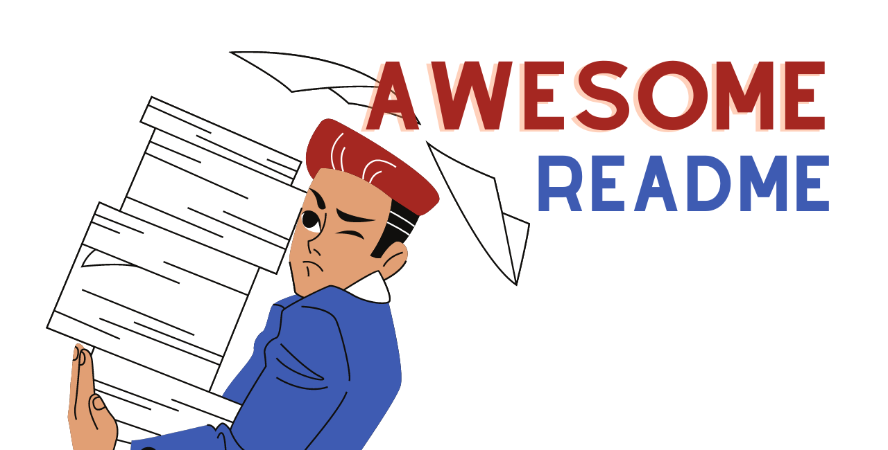

<!-- Add banner here -->


# Project Title

<!-- Add buttons here -->


<!-- Remove this note if you plan to copy this README -->

> **Note**: This was a three-year-old, un-updated repository and didn't necessarily reflect what I think a GitHub README should look like.
>
> But it still receives a lot of likes and stars, so I thought it was time to update it.
>
> If you are looking for the old version, you can find it [here](https://github.com/navendu-pottekkat/awesome-readme/tree/a3a427abfdfc8567a3565012bcdf10c3a3f938ca).
>
> This guide is for small open source projects without dedicated websites to provide extensive documentation and just need a README to help users use the project.

Here is an [empty template](./README-template.md) you can reuse.

<!-- Describe your project in brief -->

The project title is a level 1 heading (`<h1>Project Title</h1>` or `# Project Title`).

If your project has a name, then this is where it would go.

If your project does not have a name, you can use this space to explain the project. For example, code repositories of research papers usually have the paper title here.

You can also add your branding in a cover image. It makes the README unique and gets people's attention quickly.

Wait, I forgot something. You can use this README as a template from [this link](README-template.md).

I usually prefer the dimensions 1280×650. It has worked well for me so far. I can also reuse it as my social preview image for the repo.

Below the title, you will see some badges. These can be used to show the status of the project.

The badges used here were generated with [shields.io](https://shields.io/).

You can add a workflow status badge to indicate the status of your workflows in your README. This can used to answer questions like, `is the build working?` or `are the e2e tests passing?`.

The badges used here are explained below:

<!-- Add badges with link to Shields IO -->


: Shows the current release version.


: Shows the last commit time. Good indication of the project activity.


: Dynamic badge that shows the number of open issues in the project.


: Similar dynamic badge, but for pull requests.


: Shows the open source license the project uses.

# Quickstart/Demo

<!-- Add a demo for your project -->

I believe that you should bring value to the reader as soon as possible. You should be able to get the user up and running with your project with minimal friction.

If you have a quickstart guide, this is where it should be.

Alternatively, you can add a demo to show what your project can do.

# Table of Contents

GitHub has a ToC feature now. It works really well, so this might not be needed. Still, if you want to add a ToC in the README, you can add it here.

I just learned that VS Code automatically updates the ToC if you change any of the headings. Pretty cool!

- [Project Title](#project-title)
- [Quickstart/Demo](#quickstartdemo)
- [Table of Contents](#table-of-contents)
- [Installation](#installation)
- [Usage](#usage)
- [Development](#development)
- [Contribute](#contribute)
- [License](#license)

# Installation
[(Back to top)](#table-of-contents)

> **Note**: For longer README files, I usually add a "Back to top" buttton as shown above. It makes it easy to navigate.

This is where your installation instructions go.

You can add snippets here that your readers can copy-paste with click:

```shell
gh repo clone navendu-pottekkat/awesome-readme
```

# Usage
[(Back to top)](#table-of-contents)

Next, you have to explain how to use your project. You can create subsections under here to explain more clearly.

# Development
[(Back to top)](#table-of-contents)

You have people who want to use your project and then you have people who want contribute to your project.

This is where you provide instructions for the latter.

Add instructions on how to set up a development environment, clone, and build the project.

You can use the code snippets here as well:

```shell
command to clone your project
command to build your project
command to run your project in development mode
```


# Contribute
[(Back to top)](#table-of-contents)

You can use this section to highlight how people can contribute to your project.

You can add information on how they can open issues or how they can sponsor the project.

# License
[(Back to top)](#table-of-contents)

You can also mention what license the project uses. I usually add it like this:

[MIT license](./LICENSE)
